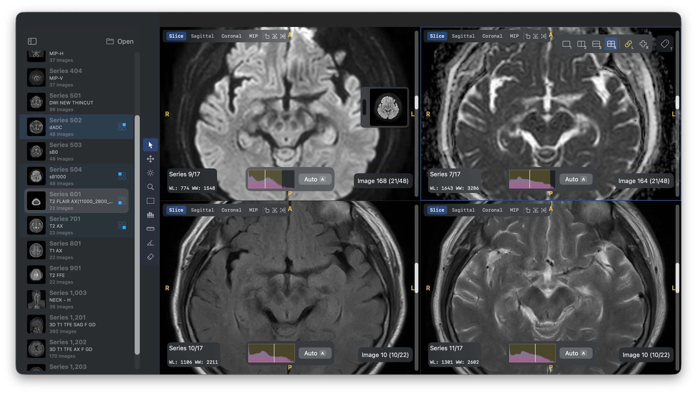
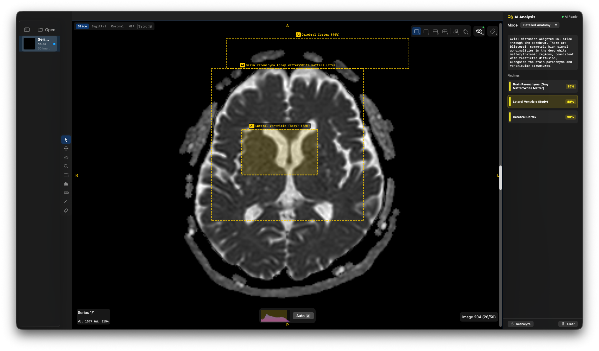

<p align="center">
  
</p>

<h1 align="center">OpenDicomViewer-Annotate</h1>

<p align="center">
  <strong>AI-powered DICOM annotation on your Mac — fully local, fully private.</strong><br>
  Built on <a href="https://github.com/jnheo-md/open-dicom-viewer">OpenDicomViewer</a>, enhanced with <strong>Gemma 4 E4B</strong> running on Apple Silicon via MLX.<br>
  No cloud. No uploads. Your medical images never leave your machine.
</p>

<p align="center">
  <a href="https://github.com/Essential-Citronnier/ODV-Annotate/releases/download/v1.2.1/OpenDicomViewer-Annotate.dmg">Download DMG</a> &middot;
  <a href="https://github.com/Essential-Citronnier/ODV-Annotate/releases/tag/v1.2.1">Releases</a>
</p>





## What is OpenDicomViewer-Annotate?

OpenDicomViewer-Annotate extends the open-source [OpenDicomViewer](https://github.com/jnheo-md/open-dicom-viewer) with **on-device AI annotation** powered by Google's **Gemma 4 E4B** vision-language model. The AI runs entirely on your Mac through [MLX](https://github.com/ml-explore/mlx) — Apple's machine learning framework optimized for Apple Silicon.

This means you can analyze DICOM images, detect anatomical structures, identify potential abnormalities, and get natural language descriptions of regions of interest — all without sending a single byte to the cloud.

## Key Features

### AI Annotation with Gemma 4 E4B

| Feature | Description |
|---------|-------------|
| **Analyze Image** | Full image analysis with anatomical structure detection and bounding boxes |
| **Describe ROI** | Select any region and get a natural language description from the AI |
| **Detect Abnormalities** | Highlight potential abnormalities with severity ratings and confidence scores |

**Four analysis modes** to fit your workflow:

- **Clinical** — Only clinically significant findings (max 3 boxes)
- **Detailed Anatomy** — All visible anatomical structures (min 3 boxes)
- **Abnormality Only** — Pathological findings only (max 2 boxes)
- **Educational** — Labeled anatomy for learning (3-5 structures)

AI annotations display as color-coded bounding boxes overlaid on DICOM images with confidence badges. Toggle visibility or clear them per panel at any time.

### Full-Featured DICOM Viewer

All the capabilities of OpenDicomViewer are included:

- **Fast DICOM Parsing** — Pure-Swift parser with incremental scanning; first image displays instantly
- **Multi-Panel Layouts** — Single, side-by-side, stacked, and quad arrangements with drag-and-drop
- **MPR & Volume Rendering** — Sagittal, coronal, and MIP views via Metal compute shaders
- **Window/Level** — Right-click drag, auto W/L, ROI-based W/L with live histogram
- **Measurement Tools** — Ruler, angle, and ROI statistics with real-time preview lines
- **Synchronized Scrolling & Zoom** — Link panels by anatomical z-location matching
- **Cross-Reference Lines** — Slice intersection overlays across panels
- **DICOM Tag Inspector** — Browse all metadata tags for the active image
- **JPEG 2000 Support** — Compressed transfer syntaxes via DCMTK + OpenJPEG

## Quick Start

### Download & Run

Download the latest `.dmg` from [Releases](../../releases), open it, and drag **OpenDicomViewer-Annotate** to your Applications folder.

> The app is signed and notarized — no Gatekeeper warnings.

### First-Run AI Setup

On first launch, the app automatically:

1. Extracts the bundled Python 3.11 runtime
2. Creates an isolated virtual environment
3. Installs MLX and dependencies
4. Downloads the Gemma 4 E4B model (~4.5GB, one-time)

After setup, the AI server starts on `http://127.0.0.1:8741`. You can also control it from the **AI** menu.

### System Requirements

- **Apple Silicon Mac** (M1 Pro or better recommended)
- **macOS 14.0+** (Sonoma)
- **16GB+ RAM** recommended (model uses ~4-5GB)
- **5GB+ free disk space** for the AI model

> No Python installation required — a standalone Python runtime is bundled with the app.

### For Developers

```bash
# Clone and build
git clone https://github.com/Essential-Citronnier/ODV-Annotate.git
cd ODV-Annotate

# Build release and package as .app bundle
./scripts/package_app.sh

# Install (optional)
cp -r OpenDicomViewer-Annotate.app /Applications/
```

To run the test suite:

```bash
swift test
```

To rebuild native dependencies from source:

```bash
./scripts/setup_native_deps.sh
```

## How the AI Works

OpenDicomViewer-Annotate runs **Gemma 4 E4B (4-bit quantized)** locally through a FastAPI server backed by [mlx-vlm](https://github.com/Blaizzy/mlx-vlm). The architecture is straightforward:

```
┌──────────────────────┐       HTTP (localhost)       ┌──────────────────────┐
│  SwiftUI Application │  ◄──────────────────────►    │   MLX Server (py)    │
│                      │     JSON + Base64 images     │                      │
│  • AIService.swift   │                              │  • Gemma 4 E4B       │
│  • AIServerManager   │                              │  • 4-bit quantized   │
│  • Annotation UI     │                              │  • Apple Silicon GPU  │
└──────────────────────┘                              └──────────────────────┘
```

The Swift app manages the server lifecycle — starting, monitoring, and stopping it automatically. Images are encoded as base64 PNG and sent over localhost. The model returns structured JSON with bounding box coordinates and descriptions.

### API Endpoints

| Endpoint | Method | Description |
|----------|--------|-------------|
| `/health` | GET | Server status, model info, memory usage |
| `/modes` | GET | Available analysis modes |
| `/analyze` | POST | Full image analysis with structure detection |
| `/describe-roi` | POST | Describe a selected region of interest |
| `/detect-abnormalities` | POST | Detect potential abnormalities |

> **Disclaimer:** AI analysis is for **research and educational purposes only**. It must NOT be used as a clinical diagnosis tool.

## Keyboard Shortcuts

### Navigation

| Key | Action |
|-----|--------|
| `Up` / `Down` | Previous / next image in series |
| `Left` / `Right` | Previous / next series |
| `Scroll` | Navigate slices |
| `Page Up` / `Page Down` | Skip 10 images |
| `Home` / `End` | Jump to first / last image |
| `Tab` | Cycle active panel |
| `Double-click` | Toggle panel fullscreen |

### Layout

| Key | Action |
|-----|--------|
| `1` / `2` / `3` / `4` | Single / side-by-side / stacked / quad |
| `Cmd+Shift+M` | MPR layout |

### Tools

| Key | Tool |
|-----|------|
| `V` | Select (default pointer) |
| `P` | Pan |
| `W` | Window/Level |
| `Z` | Zoom |
| `O` | ROI Window/Level |
| `S` | ROI Statistics |
| `D` | Ruler (distance) |
| `N` | Angle |
| `E` | Eraser |
| `G` | AI Analyze |
| `Cmd+Shift+G` | Analyze Image (menu) |

### Display

| Key | Action |
|-----|--------|
| `A` | Auto window/level |
| `I` | Invert image |
| `F` | Fit to window |
| `R` | Reset view (zoom, pan, W/L) |
| `H` | Flip horizontal |
| `]` or `.` | Rotate clockwise 90 |
| `[` or `,` | Rotate counter-clockwise 90 |

### Overlays & Multi-Panel

| Key | Action |
|-----|--------|
| `T` | Toggle DICOM tag inspector |
| `X` | Toggle cross-reference lines |
| `L` | Toggle synchronized scrolling & zoom |

### Mouse Actions

| Input | Action |
|-------|--------|
| Left-click | Activate panel / tool action |
| Right-drag | Adjust Window/Level |
| Scroll wheel | Navigate slices |
| Option/Ctrl + Left-drag | Pan (any tool) |
| Option/Ctrl + Scroll | Zoom in/out |
| Double-click | Toggle fullscreen panel |
| Drag from sidebar | Assign series to panel |
| Drag from Finder | Open DICOM file/folder |

## Architecture

```
Sources/
├── OpenDicomViewer/              # Main application target
│   ├── App.swift                     # App entry point, menu bar + AI commands
│   ├── ContentView.swift             # Root view: sidebar + detail split
│   ├── DICOMModel.swift              # Core model: loading, caching, AI triggers
│   ├── SimpleDICOM.swift             # Pure-Swift DICOM parser
│   ├── MultiPanelContainer.swift     # Multi-panel grid, overlays, AI annotation UI
│   ├── PanelState.swift              # Per-panel state incl. AI annotations
│   ├── AIService.swift               # HTTP client for Gemma 4 MLX server
│   ├── AIServerManager.swift         # MLX server lifecycle & first-run setup
│   ├── LayoutToolbar.swift           # Floating layout/link toolbar
│   ├── CrossReferenceOverlay.swift   # Slice intersection lines
│   ├── MPREngine.swift               # CPU-based multi-planar reconstruction
│   ├── MetalVolumeRenderer.swift     # GPU MIP/MinIP/Average via Metal
│   ├── VolumeData.swift              # 3D voxel buffer with affine transforms
│   ├── VolumeToolbar.swift           # MPR/MIP mode controls
│   ├── HelpView.swift                # In-app help viewer
│   ├── TagView.swift                 # DICOM tag list view
│   └── Extensions.swift              # Collection helpers
├── DCMTKWrapper/                 # Objective-C++ bridge to DCMTK
│   ├── DCMTKHelper.mm               # DCMTK + JPEG2000 decoding
│   └── include/DCMTKHelper.h
└── mlx-server/                   # Local Gemma 4 inference server
    ├── server.py                     # FastAPI + mlx-vlm inference
    ├── launch.sh                     # Setup & launch script
    └── requirements.txt              # Python dependencies
```

## Acknowledgments

This project is built on top of [OpenDicomViewer](https://github.com/jnheo-md/open-dicom-viewer) by [jnheo-md](https://github.com/jnheo-md). The original viewer provides the foundation — fast DICOM parsing, multi-panel layouts, MPR, measurement tools, and more. OpenDicomViewer-Annotate adds the AI annotation layer on top of this excellent base.

## License

This project is licensed under the MIT License — see [LICENSE](LICENSE) for details.

DCMTK is licensed under the BSD license. OpenJPEG is licensed under BSD-2-Clause. See [THIRD_PARTY_LICENSES.md](THIRD_PARTY_LICENSES.md) for full license texts.

## Dependencies

| Library | Version | Purpose | License |
|---------|---------|---------|---------|
| [DCMTK](https://dicom.offis.de/dcmtk.php.en) | 3.6.8 | DICOM image decoding, JPEG/JPEG-LS decompression | BSD |
| [OpenJPEG](https://www.openjpeg.org/) | 2.5.0 | JPEG 2000 decompression | BSD-2-Clause |
| [MLX](https://github.com/ml-explore/mlx) | latest | Apple Silicon ML framework for local inference | MIT |
| [mlx-vlm](https://github.com/Blaizzy/mlx-vlm) | latest | Vision-language model inference on MLX | MIT |
| [Gemma 4 E4B](https://huggingface.co/mlx-community/gemma-4-E4B-it-4bit) | 4-bit | Vision-language model for DICOM annotation | Gemma |

DCMTK and OpenJPEG are included as pre-built static libraries (`libs/`). Python 3.11, MLX, and Gemma are bundled with or automatically downloaded by the app.
